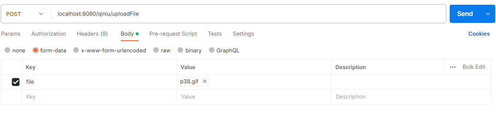

# 📖springboot-uploadFile   
## ✨简介：
* springboot集成各种云存储，只需切换配置文件中**strategy**
* 目前支持储存：

| 支持  | 储存  |  策略   |                                             官方文档                                              |
|:----|:---:|:-----:|:---------------------------------------------------------------------------------------------:|
| ✅   | 本 地 | local |                                          [文档地址](#a)                                           |
| ✅   | 阿里云 |  oss  | [文档地址](https://help.aliyun.com/document_detail/32011.html?spm=a2c4g.32009.0.0.7165c927AZwNV1) |
| ✅   | 腾讯云 |  cos  |                 [文档地址](https://cloud.tencent.com/document/product/436/10199)                  |
| ✅   | 七牛云 | qiniu |                      [文档地址](https://developer.qiniu.com/kodo/1239/java)                       |
| ❎   | 华为云 |  obs  |          [文档地址](https://support.huaweicloud.com/sdk-java-devg-obs/obs_21_0001.html)           |
| ❎   | 百度云 |  obs  |                      [文档地址](https://cloud.baidu.com/doc/BOS/s/Fjwvyrqw2)                      |
_****后续会补**_

## 使用方法
* POST localhost:8080/qiniu/uploadFile

## <a id="a">本地nginx代理文件</a>
 * 访问地址：/ip:19003/img
 * 文件目录：/home/local/upload
~~~ nginx
server {
        listen       19003;
        server_name  localhost;

        #charset koi8-r;
        #access_log  logs/host.access.log  main;

		#配置跨域
		add_header Access-Control-Allow-Origin *;
    	add_header Access-Control-Allow-Methods GET,POST,OPTIONS;
        add_header Access-Control-Allow-Headers Content-Type,Authorization;

        location /img/ {
            root   /home/local/upload;
			#开启目录浏览功能； 
			autoindex on;  
			#关闭详细文件大小统计，让文件大小显示MB，GB单位，默认为b；			
			autoindex_exact_size off;  
			#开启以服务器本地时区显示文件修改日期！ 			
			autoindex_localtime on;
            
        }
}
